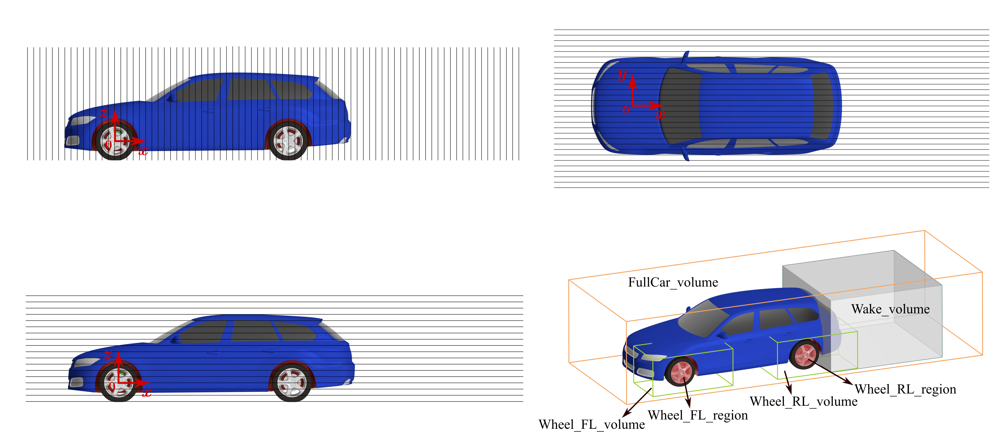

<div align="center">

# DrivAerRim

### A full vehicle dataset with rotating wheels for data-driven aerodynamic design of wheel rims

[](https://huggingface.co/datasets/BeyondXia1212/DrivAerRim)
[](LICENSE.md)

[Dataset](https://huggingface.co/datasets/BeyondXia1212/DrivAerRim) ·
[Files](https://huggingface.co/datasets/BeyondXia1212/DrivAerRim/tree/main) ·
[Scripts](Codes/) ·
[Citation](#citation) ·
[Contact](#contact)


</div>

## Overview

**DrivAerRim** is a full vehicle computational fluid dynamics (CFD) dataset created to isolate the aerodynamic effects of rim geometry. It contains simulations of all **904 non-parametric rim geometries** from the [DeepWheel](https://huggingface.co/datasets/KAIST-SmartDesignLab/DeepWheel) collection installed on a fixed, full scale DrivAer estateback.

Only the rim geometry changes between cases. The vehicle, closed cooling configuration, smooth underbody, deformed Rain tyres, wheel positions, operating conditions, mesh strategy, solver settings, and exported quantities remain consistent. Each case uses the same rim design at all four wheel positions.

Wheel rotation is represented using cylindrical **moving reference frame (MRF)** regions around the rims together with rotating wall boundary conditions on the tyres. This setup retains geometry-dependent flow through the rim openings while remaining practical for a large Reynolds-averaged Navier-Stokes (RANS) dataset.

The release supports two complementary uses:

- analysis of how rim geometry changes complete vehicle and component aerodynamics;
- development and evaluation of geometric deep learning surrogate models for aerodynamic coefficients and surface or flow fields.

## At a glance

| Item | Description |
|---|---|
| Cases | 904, named `Rim0001` to `Rim0904` |
| Total file size | Approximately 9.32 TB (8.48 TiB) |
| Vehicle | Full scale DrivAer estateback, closed cooling, smooth underbody |
| Tyres | Deformed Rain pattern with longitudinal grooves and ground contact patches |
| CFD method | Three-dimensional steady incompressible RANS |
| Turbulence model | Realizable $k$-$\varepsilon$ two-layer model |
| Wheel treatment | Rim MRF regions and rotating wall tyres |
| Inlet speed | 140 km/h |
| Main formats | STL, CSV, VTP, VTU, WebP, and PNG |
| Data host | [Hugging Face Datasets](https://huggingface.co/datasets/BeyondXia1212/DrivAerRim) |

## Rim diversity

The dataset covers the complete set of 904 DeepWheel designs rather than a small parametric family. The rims span diverse spoke connections, opening layouts, and topologies, providing controlled local geometric variation on a common vehicle.


## Dataset workflow


1. **Rim preprocessing:** the STL meshes are repaired, scaled, and assembled with the DrivAer wheels.
2. **Automated batch CFD:** case preparation, meshing, solution, monitoring, and postprocessing are executed through an automated high performance computing workflow.
3. **Exported data:** each completed case provides numerical summaries, geometry, surface fields, prescribed slices, local wheel volumes, a wake volume, a volume surrounding the complete vehicle, preview images, and convergence histories.

## Dataset contents

| Location | Contents |
|---|---|
| `Geometry/` | Vehicle body and front left or rear left wheel component STL geometry |
| `NumData/` | Combined aerodynamic coefficients and accumulated drag records for all cases |
| `RimXXXX/Pictures/` | Field previews and complete vehicle drag convergence history |
| `RimXXXX/Slices/` | Velocity, pressure, and total turbulent kinetic energy on 128 prescribed planes |
| `RimXXXX/Surfaces/` | Complete vehicle and component surface pressure and wall shear stress |
| `RimXXXX/Volumes/` | Six types of fluid volume: front and rear wheel MRF regions, local wheel volumes, the wake, and the region surrounding the complete vehicle |

### Data repository structure

The Hugging Face data repository uses the following file patterns:

```text
DrivAerRim/
├── NumData/
│   ├── Force_Coefficients_Combined.csv
│   └── Cd_Accumulated_Combined.csv
├── Geometry/
│   ├── Car_Body/Car_Body.stl
│   ├── Wheel_FL/Wheel_FL_XXXX.stl
│   ├── Wheel_RL/Wheel_RL_XXXX.stl
│   ├── WheelHouse_FL/WheelHouse_FL.stl
│   ├── WheelHouse_RL/WheelHouse_RL.stl
│   ├── WheelSupport_FL/WheelSupport_FL.stl
│   └── WheelSupport_RL/WheelSupport_RL.stl
└── RimXXXX/
    ├── Surfaces/
    │   ├── FullCar/FullCar_XXXX.vtp
    │   ├── Wheel_FL/Wheel_FL_XXXX.vtp
    │   ├── Wheel_RL/Wheel_RL_XXXX.vtp
    │   ├── WheelHouse_FL/WheelHouse_FL_XXXX.vtp
    │   ├── WheelHouse_RL/WheelHouse_RL_XXXX.vtp
    │   ├── WheelSupport_FL/WheelSupport_FL_XXXX.vtp
    │   └── WheelSupport_RL/WheelSupport_RL_XXXX.vtp
    ├── Slices/
    │   ├── X/X_<position>/X_<position>_XXXX.vtp
    │   ├── Y/Y_<position>/Y_<position>_XXXX.vtp
    │   └── Z/Z_<position>/Z_<position>_XXXX.vtp
    ├── Volumes/
    │   ├── Wheel_FL_region/Wheel_FL_region_XXXX.vtu
    │   ├── Wheel_FL_volume/Wheel_FL_volume_XXXX.vtu
    │   ├── Wheel_RL_region/Wheel_RL_region_XXXX.vtu
    │   ├── Wheel_RL_volume/Wheel_RL_volume_XXXX.vtu
    │   ├── Wake_volume/Wake_volume_XXXX.vtu
    │   └── FullCar_volume/FullCar_volume_XXXX.vtu
    └── Pictures/
        ├── <preview_name>.webp
        └── Cd_steady_history.png
```

`<position>` denotes the slice coordinate in millimetres, and `<preview_name>` denotes the descriptive name of a preview image.

`XXXX` is a zero-padded case number from `0001` to `0904`. The suffixes `FL` and `RL` denote front left and rear left. The right side component geometries are mirrored counterparts of those on the left. With geometrically symmetric configurations and zero yaw, the released component geometries and local spatial records focus on the front left and rear left regions. The complete vehicle surface, wake volume, and full vehicle volume include both sides.

Every case provides **128 slice files, 7 surface files, and 6 volume files**, together with at least 32 WebP previews and `Pictures/Cd_steady_history.png`. The volume records total 5,424 files, including 904 `FullCar_volume` files.

`Geometry/` contains 904 wheel assembly STL files for each of the front left and rear left positions, for example `Geometry/Wheel_FL/Wheel_FL_0001.stl`. The common body is stored at `Geometry/Car_Body/Car_Body.stl`. The two wheelhouses and two wheel supports are also shared across cases and each stored once. These STL geometries are separate from the exported CFD surface meshes.

`NumData/Force_Coefficients_Combined.csv` contains one row per case, with the integer `Rim` identifier mapping to `RimXXXX`, for example `1` to `Rim0001`. `NumData/Cd_Accumulated_Combined.csv` contains the streamwise coordinate `X` in metres and one accumulated drag coefficient column for each case, from `Rim0001` to `Rim0904`.

### Spatial outputs



Surface and slice files use VTK PolyData (`.vtp`), and volume files use VTK Unstructured Grid (`.vtu`). The 128 slices comprise 80 planes normal to x, 30 normal to y, and 18 normal to z. Slice directory and file names give the plane position in millimetres, for example `Rim0001/Slices/X/X_-100/X_-100_0001.vtp`.

| Records | Field | Quantity | Units |
|---|---|---|---|
| Surfaces | `MeanPressure` | Static pressure | Pa |
| Surfaces | `MeanWSS` | Wall shear stress vector | Pa |
| Slices and Volumes | `MeanVelocity` | Velocity vector | m/s |
| Slices and Volumes | `MeanPressure` | Static pressure | Pa |
| Slices and Volumes | `MeanTotalTKE` | Total turbulent kinetic energy | m²/s² |

The `Mean` prefix denotes averaging over the final 500 steady solver iterations, not a physical time average of an unsteady simulation.

The six volume records comprise the front left and rear left MRF regions (`Wheel_FL_region`, `Wheel_RL_region`), larger local wheel regions (`Wheel_FL_volume`, `Wheel_RL_volume`), the vehicle wake (`Wake_volume`), and the fluid region surrounding the complete vehicle (`FullCar_volume`).

| Volume | x range (m) | y range (m) | z range (m) |
|---|---|---|---|
| `FullCar_volume` | -1.5 to 6.5 | -1.5 to 1.5 | -0.3 to 1.5 |
| `Wake_volume` | 3.2 to 5.7 | -1.25 to 1.25 | -0.3 to 1.25 |

Each case includes `RimXXXX/Volumes/FullCar_volume/FullCar_volume_XXXX.vtu`, averaging approximately **5.9 GiB (6.3 GB)** per file, with the same three flow fields as the other volume records. Unlike `Surfaces/FullCar`, which describes the vehicle surface, `Volumes/FullCar_volume` contains the surrounding fluid mesh and flow fields.

### Aerodynamic overview

<p align="center">
  
  <br>
  <em>Integrated aerodynamic coefficients across all cases.</em>
</p>

<p align="center">
  
  <br>
  <em>Wheel-related drag contributions.</em>
</p>

The surface field overviews below compare the front left wheel for the 50 lowest and 50 highest complete vehicle $C_D$ cases. Within each image, the cases are ordered by increasing $C_D$ from left to right and then from top to bottom.

<p align="center">
  
  <br>
  <em>Surface pressure coefficient on the front left wheel.</em>
</p>

<p align="center">
  
  <br>
  <em>Skin friction coefficient on the front left wheel.</em>
</p>

## Code

The [`Codes/`](Codes/) directory contains the released workflow and analysis scripts:

| Script | Purpose |
|---|---|
| [`prepare.py`](Codes/prepare.py) | Creates four-digit rim case directories from a common template and installs the selected rim input |
| [`batch_run.py`](Codes/batch_run.py) | Submits cases with bounded concurrency and monitors scheduler activity |
| [`run.sh`](Codes/run.sh) | SLURM template for STAR-CCM+ preparation, meshing, solution, and postprocessing handoff |
| [`post.sh`](Codes/post.sh) | GPU job template for field and image export after a completed simulation |
| [`plot_all_rims_bins.py`](Codes/plot_all_rims_bins.py) | Compares accumulated drag curves across the rim cases |
| [`plot_rim_aero_analysis.py`](Codes/plot_rim_aero_analysis.py) | Analyses complete vehicle and wheel component aerodynamic coefficients across all cases |

`prepare.sh` and `batch_run.sh` are compatibility wrappers for the Python tools. The SLURM scripts use public placeholders for cluster account, email, licence, and path settings. The released `run.sh` requests 2,880 tasks, matching the per-case CPU core count reported for dataset production. See the [code documentation](Codes/README.md) for configuration and examples.

## Download

The complete data release contains approximately **9.32 TB of files (8.48 TiB)**, so targeted downloads are recommended. The Hugging Face command line client can retrieve selected directories without cloning the complete repository.

```bash
pip install -U huggingface_hub
```

Download the combined numerical summaries:

```bash
hf download BeyondXia1212/DrivAerRim \
  --repo-type dataset \
  --include "NumData/**" \
  --local-dir DrivAerRim
```

Download spatial fields and pictures for one case. The shared and case-specific STL files are stored separately under `Geometry/`:

```bash
hf download BeyondXia1212/DrivAerRim \
  --repo-type dataset \
  --include "Rim0001/**" \
  --local-dir DrivAerRim
```

Download only the full vehicle volume for one case:

```bash
hf download BeyondXia1212/DrivAerRim \
  Rim0001/Volumes/FullCar_volume/FullCar_volume_0001.vtu \
  --repo-type dataset \
  --local-dir DrivAerRim
```

Python example for the numerical summaries and one case's spatial fields and pictures:

```python
from huggingface_hub import snapshot_download

snapshot_download(
    repo_id="BeyondXia1212/DrivAerRim",
    repo_type="dataset",
    allow_patterns=["NumData/**", "Rim0001/**"],
    local_dir="DrivAerRim",
)
```

CSV files can be read using standard tabular data tools. VTP and VTU files can be inspected using [ParaView](https://www.paraview.org/) or other software that supports the Visualization Toolkit format.

## Citation

The accompanying manuscript is in preparation. Until a formal publication identifier is available, please cite the dataset as follows:

```bibtex
@dataset{xia2026drivaerrim,
  author    = {Xia, Chao and Lewerth, Carl and Zeng, Xi and Vdovin, Alexey and Sebben, Simone and Jia, Qing and Yang, Zhigang},
  title     = {DrivAerRim: A full vehicle dataset with rotating wheels for data-driven aerodynamic design of wheel rims},
  year      = {2026},
  publisher = {Hugging Face},
  url       = {https://huggingface.co/datasets/BeyondXia1212/DrivAerRim}
}
```

Please also cite the source rim collection:

> Yoo, S. & Kang, N. DeepWheel: Generating a 3D Synthetic Wheel Dataset for Design and Performance Evaluation. *Journal of Mechanical Design* **148**, 051702 (2026). [https://doi.org/10.1115/1.4069899](https://doi.org/10.1115/1.4069899)

The machine-readable metadata are provided in [`CITATION.cff`](CITATION.cff). Please also cite the accompanying DrivAerRim article once its formal publication identifier becomes available, while retaining the dataset and source geometry citations.

## License and provenance

DrivAerRim is released under the [Creative Commons Attribution-NonCommercial 4.0 International license](LICENSE.md).

The source rim meshes were adapted from the third-party [DeepWheel dataset](https://huggingface.co/datasets/KAIST-SmartDesignLab/DeepWheel), created by Soyoung Yoo and Namwoo Kang and distributed under CC BY-NC 4.0. They were repaired, scaled, and integrated into the DrivAer wheel assemblies for the present simulations. The non-commercial restriction is retained in this derived release. Users should attribute both DrivAerRim and DeepWheel and state any further modifications when redistributing the material.

## Acknowledgements

The dataset was created by researchers at Chalmers University of Technology and Tongji University. The authors acknowledge Ford of Europe for access to the DrivAer model and Volvo Cars for tyre, rim, and wind tunnel validation data, technical discussions, and advice. We thank Soyoung Yoo and Namwoo Kang for their helpful correspondence regarding use of the DeepWheel dataset.

This work was funded by the Transport Area of Advance Seed Project 2026 at Chalmers University of Technology. Computational resources were provided by the National Academic Infrastructure for Supercomputing in Sweden (NAISS), funded by the Swedish Research Council.

## Contact

Questions about the dataset can be directed to:

**Chao Xia**<br>
Department of Mechanical Engineering, Chalmers University of Technology<br>
[chao.xia@chalmers.se](mailto:chao.xia@chalmers.se)

The GitHub repository is the project landing page and documentation hub. The authoritative data release is hosted on [Hugging Face](https://huggingface.co/datasets/BeyondXia1212/DrivAerRim).
