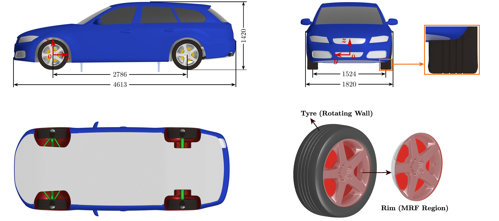
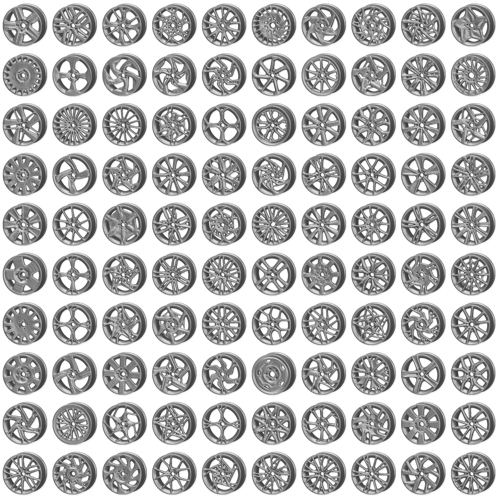
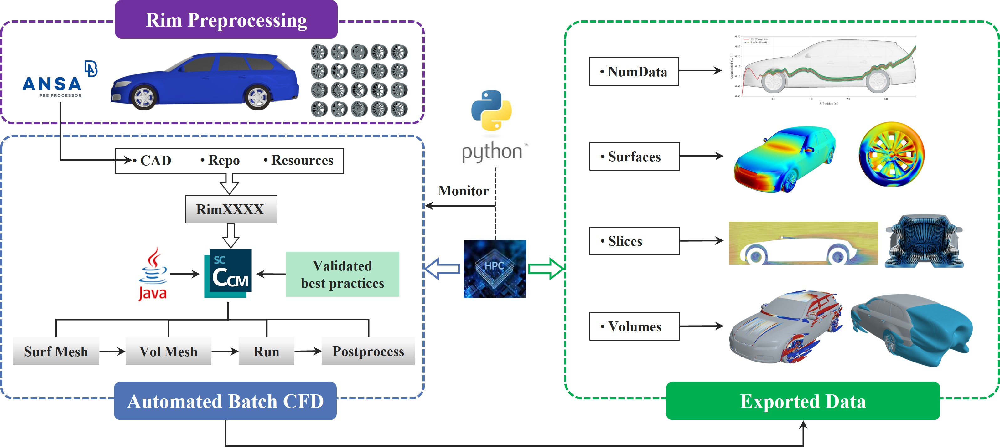
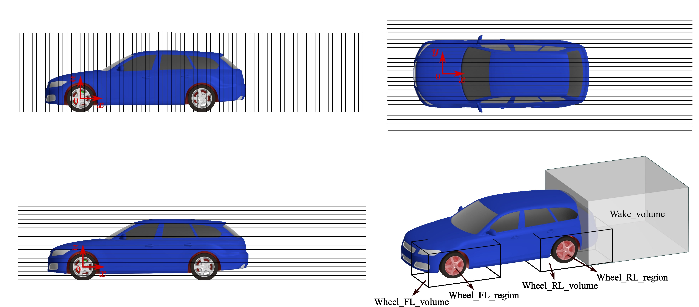
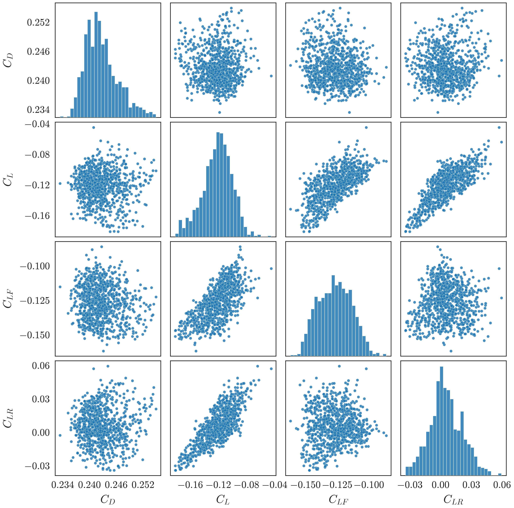
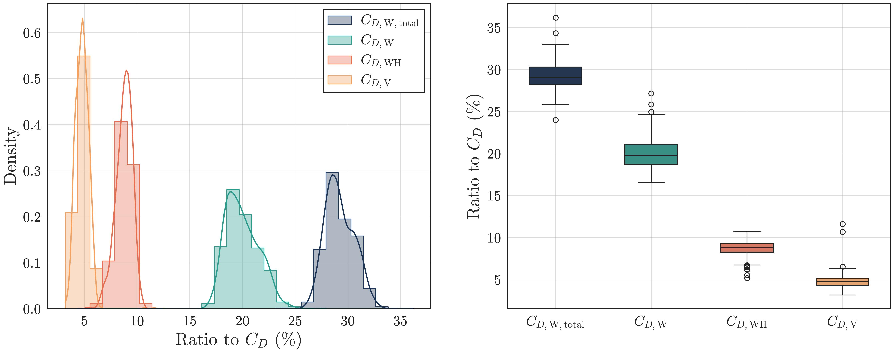
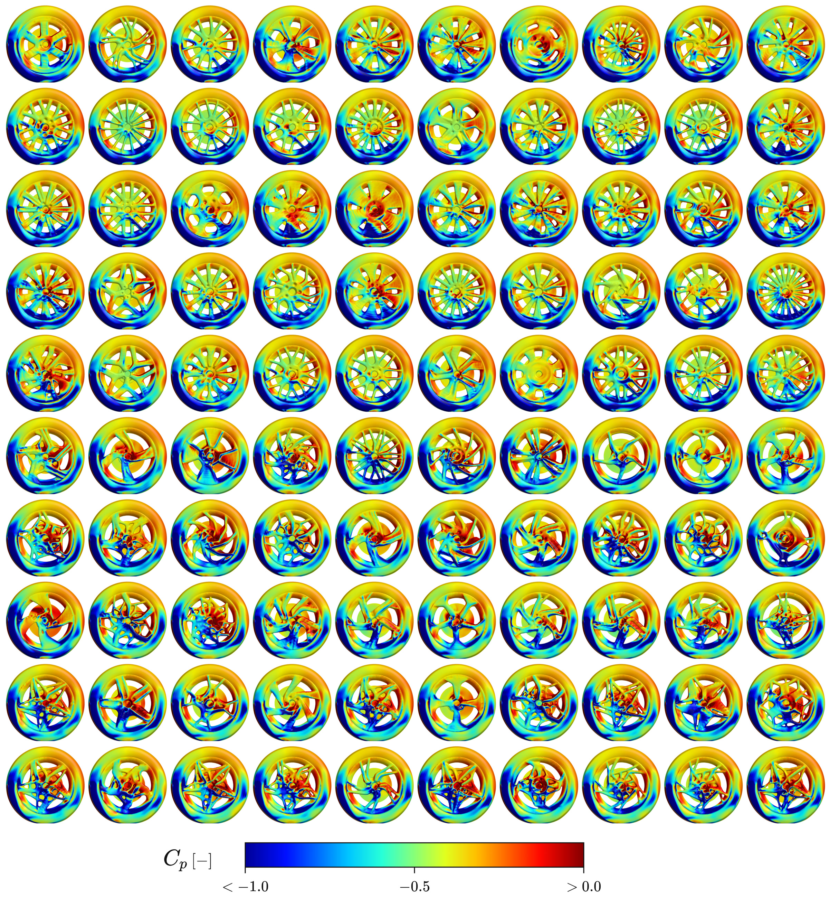
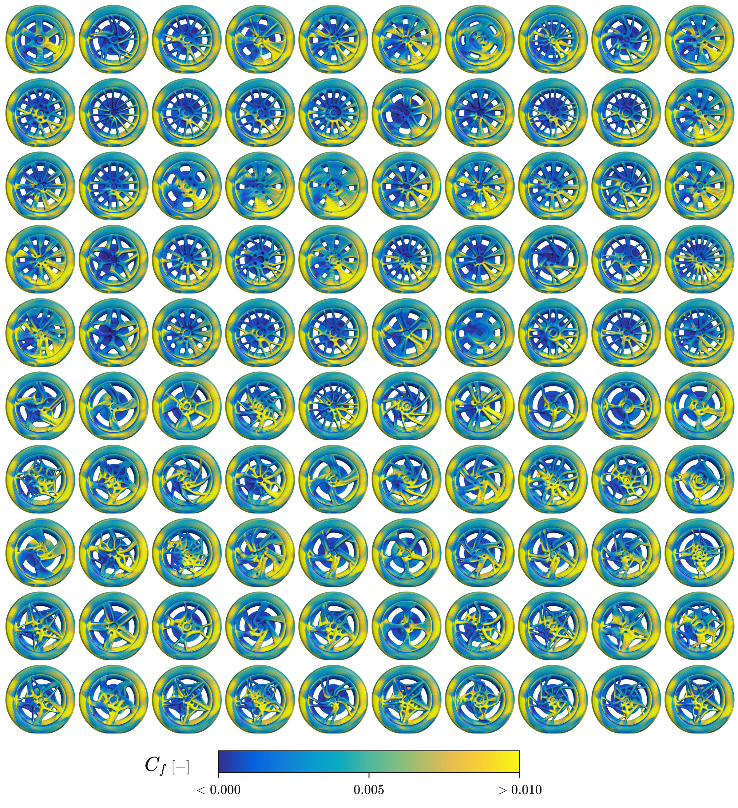

<div align="center">

# DrivAerRim

### A full vehicle simulation dataset with rotating wheels for data-driven aerodynamic design of rims

[](https://huggingface.co/datasets/BeyondXia1212/DrivAerRim)
[](LICENSE.md)

[Dataset](https://huggingface.co/datasets/BeyondXia1212/DrivAerRim) ·
[Files](https://huggingface.co/datasets/BeyondXia1212/DrivAerRim/tree/main) ·
[Scripts](Codes/) ·
[Citation](#citation) ·
[Contact](#contact)



</div>

## Overview

**DrivAerRim** is a full vehicle computational fluid dynamics (CFD) dataset created to isolate the aerodynamic effects of rim geometry. It contains simulations of all **904 non-parametric rim geometries** from the [DeepWheel](https://huggingface.co/datasets/KAIST-SmartDesignLab/DeepWheel) collection installed on a fixed, full scale DrivAer estateback.

Only the rim geometry changes between cases. The vehicle, closed cooling configuration, smooth underbody, deformed Rain tyres, wheel positions, operating conditions, mesh strategy, solver settings, and exported quantities remain consistent. Each case uses the same rim design at all four wheel positions.

Wheel rotation is represented using cylindrical **moving reference frame (MRF)** regions around the rims together with rotating wall boundary conditions on the tyres. This setup retains geometry-dependent flow through the rim openings while remaining practical for a large Reynolds-averaged Navier-Stokes (RANS) dataset.

The release supports two complementary uses:

- controlled analysis of how rim geometry changes complete vehicle and component aerodynamics;
- development and evaluation of geometric deep learning surrogate models for integrated coefficients and spatial surface or flow fields.

## At a glance

| Item | Description |
|---|---|
| Cases | 904, named `Rim0001` to `Rim0904` |
| Total size | Approximately 3.40 TB |
| Vehicle | Full scale DrivAer estateback, closed cooling, smooth underbody |
| Tyres | Deformed Rain pattern with longitudinal grooves and ground contact patches |
| CFD method | Three-dimensional steady incompressible RANS |
| Turbulence model | Realizable $k$-$\varepsilon$ two-layer model |
| Wheel treatment | Rim MRF regions and rotating wall tyres |
| Inlet speed | 140 km/h |
| Main formats | STL, CSV, VTP, VTU, WebP, and PNG |
| Data host | [Hugging Face Datasets](https://huggingface.co/datasets/BeyondXia1212/DrivAerRim) |

## Rim diversity

The dataset covers the complete set of 904 DeepWheel designs rather than a small parametric family. The rims span diverse spoke connections, opening layouts, and topologies, providing controlled local geometric variation on a common vehicle.



## Dataset workflow



1. **Rim preprocessing:** the STL meshes are repaired, scaled, and assembled with the DrivAer wheels.
2. **Automated batch CFD:** case preparation, meshing, solution, monitoring, and postprocessing are executed through an automated high performance computing workflow.
3. **Exported data:** each completed case provides numerical summaries, geometry, surface fields, prescribed slices, local wheel volumes, a wake volume, preview images, and convergence histories.

## Dataset contents

| Location | Contents |
|---|---|
| `Geometry/` | Vehicle body and front left or rear left wheel component STL geometry |
| `NumData/` | Combined aerodynamic coefficients and accumulated drag records for all cases |
| `RimXXXX/Pictures/` | Field previews and complete vehicle drag convergence history |
| `RimXXXX/Slices/` | Velocity, pressure, and total turbulent kinetic energy on 128 prescribed planes |
| `RimXXXX/Surfaces/` | Complete vehicle and component surface pressure and wall shear stress |
| `RimXXXX/Volumes/` | Front and rear wheel regions, wheel volumes, and a vehicle wake volume |

`XXXX` is a zero-padded case number from `0001` to `0904`. The suffixes `FL` and `RL` denote front left and rear left. The right side installations are mirrored counterparts, so the released component geometries and local spatial records focus on the left side wheel regions.

Each case contains 128 slice files, 7 surface files, 5 volume files, 32 WebP previews, and one complete vehicle drag history.

### Spatial outputs



Surface records contain mean pressure and mean wall shear stress. Slice and volume records contain velocity, pressure, and total turbulent kinetic energy. The wake volume complements the wheel-centred records for studying downstream changes caused by rim geometry.

### Aerodynamic overview

<p align="center">
  
  <br>
  <em>Integrated aerodynamic coefficients across all cases.</em>
</p>

<p align="center">
  
  <br>
  <em>Wheel-related drag contributions.</em>
</p>

The surface field overviews below compare the front left wheel for the 50 lowest and 50 highest complete vehicle $C_D$ cases. Within each image, the cases are ordered by increasing $C_D$ from left to right and then from top to bottom.

<p align="center">
  
  <br>
  <em>Surface pressure coefficient on the front left wheel.</em>
</p>

<p align="center">
  
  <br>
  <em>Skin friction coefficient on the front left wheel.</em>
</p>

## Code

The [`Codes/`](Codes/) directory contains the released workflow and analysis scripts:

| Script | Purpose |
|---|---|
| [`prepare.sh`](Codes/prepare.sh) | Creates rim case directories from a common template and installs the selected rim geometry |
| [`run.sh`](Codes/run.sh) | SLURM template for the STAR-CCM+ preparation, meshing, solution, and postprocessing stages |
| [`post.sh`](Codes/post.sh) | GPU job template for field and image export after a completed simulation |
| [`plot_all_rims_bins.py`](Codes/plot_all_rims_bins.py) | Compares accumulated drag curves across the rim cases |
| [`plot_rim_aero_analysis.py`](Codes/plot_rim_aero_analysis.py) | Analyses complete vehicle and wheel component aerodynamic coefficients across all cases |

The shell scripts use public placeholders for cluster account, email, license, and path settings. They are designed for a SLURM environment with Simcenter STAR-CCM+ 2506 and case directories containing the associated STARCFD macros and resources. See the [code documentation](Codes/README.md) for configuration and examples.

## Download

The complete data release is approximately **3.40 TB**, so targeted downloads are recommended. The Hugging Face command line client can retrieve selected directories without cloning the complete repository.

```bash
pip install -U huggingface_hub
```

Download the combined numerical summaries:

```bash
hf download BeyondXia1212/DrivAerRim \
  --repo-type dataset \
  --include "NumData/**" \
  --local-dir DrivAerRim
```

Download one complete case:

```bash
hf download BeyondXia1212/DrivAerRim \
  --repo-type dataset \
  --include "Rim0001/**" \
  --local-dir DrivAerRim
```

Equivalent Python example:

```python
from huggingface_hub import snapshot_download

snapshot_download(
    repo_id="BeyondXia1212/DrivAerRim",
    repo_type="dataset",
    allow_patterns=["NumData/**", "Rim0001/**"],
    local_dir="DrivAerRim",
)
```

CSV files can be read using standard tabular data tools. VTP and VTU files can be inspected using [ParaView](https://www.paraview.org/) or other software that supports the Visualization Toolkit format.

## Citation

The accompanying manuscript is in preparation. Until a formal publication identifier is available, please cite the dataset as follows:

```bibtex
@dataset{xia2026drivaerrim,
  author    = {Xia, Chao and Lewerth, Carl and Zeng, Xi and Vdovin, Alexey and Sebben, Simone and Jia, Qing and Yang, Zhigang},
  title     = {DrivAerRim: A full vehicle simulation dataset with rotating wheels for data-driven aerodynamic design of rims},
  year      = {2026},
  publisher = {Hugging Face},
  url       = {https://huggingface.co/datasets/BeyondXia1212/DrivAerRim}
}
```

Please also cite the source rim collection:

> Yoo, S. & Kang, N. DeepWheel: Generating a 3D Synthetic Wheel Dataset for Design and Performance Evaluation. *Journal of Mechanical Design* **148**, 051702 (2026). [https://doi.org/10.1115/1.4069899](https://doi.org/10.1115/1.4069899)

The machine-readable metadata are provided in [`CITATION.cff`](CITATION.cff). Please replace the dataset citation with the peer-reviewed DrivAerRim article after its DOI becomes available.

## License and provenance

DrivAerRim is released under the [Creative Commons Attribution-NonCommercial 4.0 International license](LICENSE.md).

The source rim meshes were adapted from the third-party [DeepWheel dataset](https://huggingface.co/datasets/KAIST-SmartDesignLab/DeepWheel), created by Soyoung Yoo and Namwoo Kang and distributed under CC BY-NC 4.0. They were repaired, scaled, and integrated into the DrivAer wheel assemblies for the present simulations. The non-commercial restriction is retained in this derived release. Users should attribute both DrivAerRim and DeepWheel and state any further modifications when redistributing the material.

## Acknowledgements

The dataset was created by researchers at Chalmers University of Technology and Tongji University. The authors acknowledge Ford of Europe for access to the DrivAer model and Volvo Cars for tyre, rim, and wind tunnel validation data, technical discussions, and advice. We thank Soyoung Yoo and Namwoo Kang for their helpful correspondence regarding use of the DeepWheel dataset.

This work was funded by the Transport Area of Advance Seed Project 2026 at Chalmers University of Technology. Computational resources were provided by the National Academic Infrastructure for Supercomputing in Sweden (NAISS), funded by the Swedish Research Council.

## Contact

Questions about the dataset can be directed to:

**Chao Xia**<br>
Department of Mechanical Engineering, Chalmers University of Technology<br>
[chao.xia@chalmers.se](mailto:chao.xia@chalmers.se)

The GitHub repository is the project landing page and documentation hub. The authoritative data release is hosted on [Hugging Face](https://huggingface.co/datasets/BeyondXia1212/DrivAerRim).
